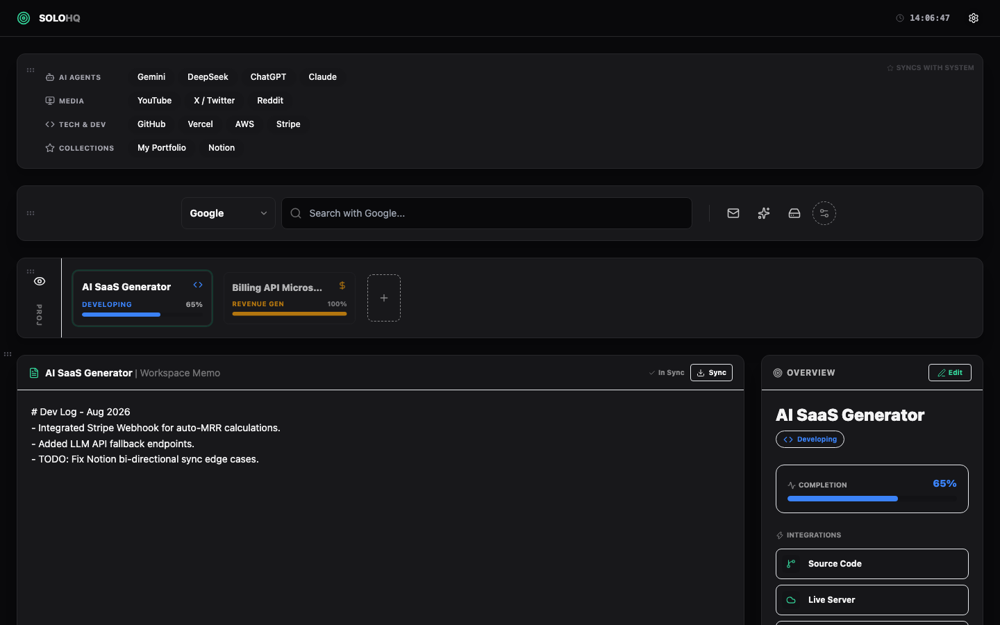

# SoloHQ

SoloHQ is a local-first dashboard for one-person companies. It brings projects, workspace memos, bookmarks, search, and revenue tracking into a single browser app. All data lives in your browser's `localStorage`, so there is no backend and no account required.

[](LICENSE)
[](https://github.com/zhaolongfei-shareye/SoloHQ/actions/workflows/ci.yml)
[](https://www.agentsbin.com/solohq/demo/)
[](https://github.com/zhaolongfei-shareye/SoloHQ)



## Features

- Project board with Developing / Launched / Revenue Gen / Abandoned milestones
- Per-project workspace memo
- Delete projects from the editor with a confirmation dialog
- Abandoned counter that only counts projects with real notes
- Quick search across Google, Bing, DuckDuckGo, and GitHub
- Bookmark collections with quick-access icons
- Google app shortcuts (Gmail, Gemini, Drive, Calendar, Meet, Keep)
- Four themes: Minimal Light, Midnight Dark, Aura Glass, Cyber Hacker
- Drag to reorder dashboard widgets
- JSON backup export and import
- Local-first persistence with no backend

## Tech Stack

- React
- Vite
- Tailwind CSS 3
- Lucide React

## Getting Started

```bash
npm install
npm run dev
```

Open http://localhost:5173/ in your browser.

## Scripts

```bash
npm run dev       # start the development server
npm run build     # create a production build
npm run preview   # preview the production build
npm run lint      # run Oxlint
npm test          # run Vitest
```

## Data & Privacy

All project, bookmark, theme, and revenue data is stored locally in your browser under the `solo_*` localStorage keys. Use Settings > Data Backup to export a JSON backup or import one into another browser. No data is sent to any server.

On the agentsbin.com demo, data is stored in `sessionStorage` and resets when the window closes. Download or run the app locally to keep persistent data in `localStorage`.

## Deployment

The app is a standard Vite static build and can be deployed to Vercel, Netlify, GitHub Pages, or any static host.

Live demo: https://www.agentsbin.com/solohq/demo/

[](https://vercel.com/new/clone?repository-url=https%3A%2F%2Fgithub.com%2Fzhaolongfei-shareye%2FSoloHQ)

```bash
npm run build
npm run preview
```

## Contributing

Please read [CONTRIBUTING.md](CONTRIBUTING.md) before opening a pull request.

## License

[MIT](LICENSE)
